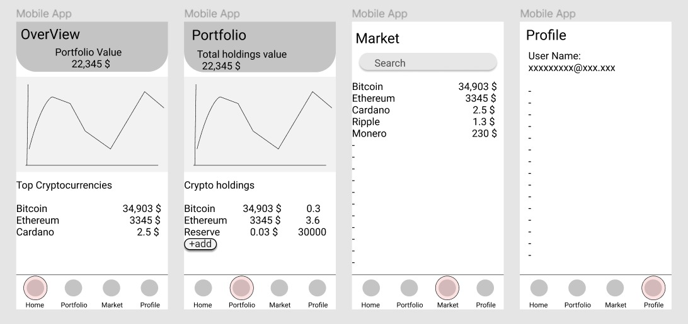
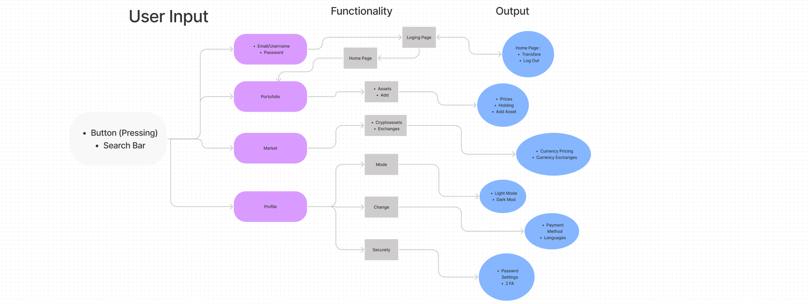
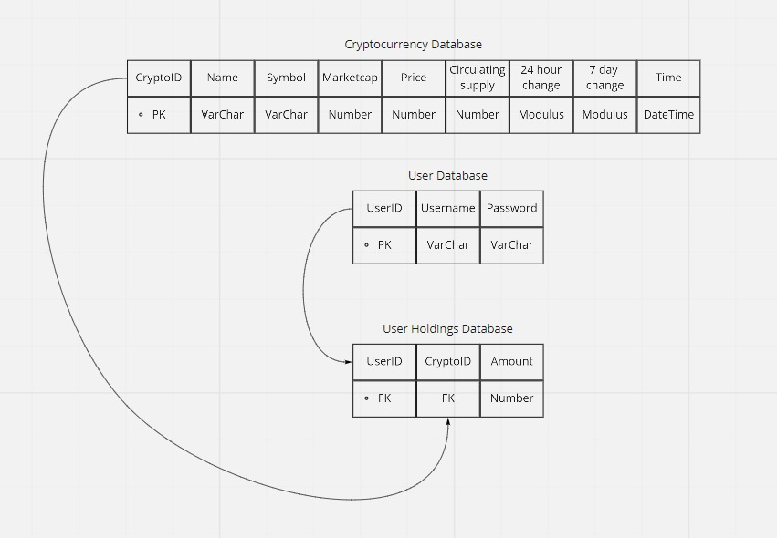

# Infinity-Application 

## Team Members:

1. Leen Hazimeh.
2. Ahmad Shalein.
3. Nadeem Mazahreh.
4. Mohammad Talafha.
5. Abdelmajed Alabed.
6. Samer Odeh.

## Project Description:

***An app that keeps track of the value of cryptocurrency holdings***

***In modern-day investing, crypto assets are very volatile, and one investor can have multiple cryptocurrency wallets, therefore, it can be hard to keep track of the value of the holdings, this app solves this issue by calculating the total holding value using an API.***

## GitHub Projects : https://github.com/orgs/Infinity-Application/projects/1

## Minimum features:

-   Cryptocurrency price API
-   Add cryptocurrency to portfolio 
-   Calculate total porfolio value 
-   Market Search bar

## Stretch Goals:

-   Graphs
-   Log in

# User Stories: https://github.com/orgs/Infinity-Application/projects/1
## Wireframe

## Domain Modeling

## Database
